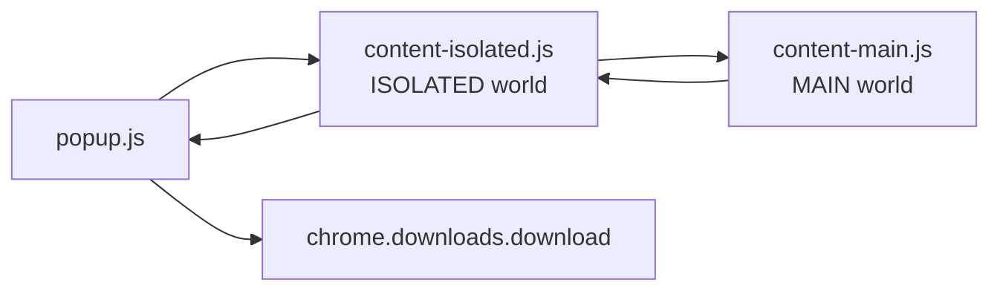

# Gemini 网页会话备份 Chrome 插件开发任务书

更新时间：2026-06-24

## 1. 项目目标

开发一个 Manifest V3 Chrome 浏览器插件，用于备份 Google Gemini 网页版历史会话记录：

- 支持将当前正在浏览的单篇 Gemini 会话导出为独立 Markdown 文件。
- 支持自动轮询左侧历史会话列表，将多篇会话打包为标准 `.zip` 文件下载。
- 支持轻量化 dry run 测试模式，只抓取 3 个独立历史会话，避免全量备份前因代码错误、网络波动或频繁点击导致长时间卡死。
- 插件必须离线自包含运行，不依赖 CDN、npm bundle 或动态远程脚本。

当前源码目录：

```text
/Users/oreo/Documents/Chrome浏览器插件/gemini-chat-backup-extension
```

## 2. 核心文件结构

插件保持 5 个核心文件，避免引入构建工具，方便其它大模型开发工具快速复刻：

```text
gemini-chat-backup-extension/
├── manifest.json
├── popup.html
├── popup.js
├── content-isolated.js
└── content-main.js
```

各文件职责：

- `manifest.json`：MV3 元数据、权限、host 权限、popup 入口、两个 content script 声明。
- `popup.html`：插件弹窗 UI，必须包含三个业务按钮。
- `popup.js`：监听按钮点击，向当前 Gemini 标签页发送指令，根据返回的 MD/ZIP 数据触发浏览器下载。
- `content-isolated.js`：运行在 `ISOLATED` world，作为 Chrome 扩展权限层与页面 `MAIN` world 之间的安全消息桥。
- `content-main.js`：运行在 `MAIN` world，负责真实 DOM 读取、会话切换点击、虚拟滚动唤醒、Markdown 解析、原生 ZIP 字节编码。

## 3. 三个业务入口

### 3.1 提取并下载当前对话 MD

按钮文案：

```text
提取并下载当前对话 (MD)
```

行为要求：

- 用户已处于某个 Gemini 具体会话页面。
- 不切换侧边栏，不点击其它历史会话。
- 直接在当前页面执行 DOM 解析。
- 返回 Markdown 文本给 `popup.js`。
- 下载文件名格式：`[会话标题].md`。

Markdown 头部必须包含：

```markdown
# [会话标题]
*备份时间: 2026/6/8 15:00:00*
*统计: 用户 X 条 / AI Y 条*
---
```

### 3.2 批量备份测试 3 个会话 ZIP

按钮文案：

```text
🧪 批量备份测试 (独立3个会话 ➔ ZIP)
```

行为要求：

- 向底层传递 `limit = 3` 和 `mode = "test"`。
- 启动前必须过滤当前页面 URL，保证抓取的是 3 个不同于当前页的历史会话。
- 只抓取左侧历史列表中前 3 个合法会话链接。
- 抓取完立即停止轮询并打包 ZIP。
- 下载文件名格式：`Gemini_测试备份_3P_[当前日期].zip`。
- 测试模式应尽量在 15 秒内闭环，因此可以使用更短等待预算，但仍要保留必要的页面加载等待和 DOM 唤醒。

### 3.3 一键全量备份历史 ZIP

按钮文案：

```text
🤖 自动化：一键备份全量历史 (ZIP)
```

行为要求：

- 向底层传递 `limit = 9999` 或等价上限。
- 自动轮询左侧历史列表中所有合法 Gemini 会话链接。
- 必须过滤当前页链接，避免在原页面重复刷新。
- 每篇会话导出为一个 Markdown 文件，再统一打包。
- 下载文件名格式：`Gemini_全量历史备份_[当前日期].zip`。

## 4. 消息链路设计

必须保留两层 content script，避免 MV3 权限层和页面真实运行环境互相污染：



实现要点：

- `popup.js` 使用 `chrome.tabs.sendMessage` 发起请求。
- `content-isolated.js` 接收扩展消息后，通过 `window.postMessage` 转发给页面主世界。
- `content-main.js` 在 `MAIN` world 读取 Gemini 页面真实 DOM，并通过 `window.postMessage` 返回结果。
- `content-isolated.js` 将页面结果转回 `sendResponse`。
- `popup.js` 根据响应类型下载 `.md` 或 `.zip`。

## 5. Manifest 要点

`manifest.json` 必须满足：

- `manifest_version: 3`
- `permissions` 至少包含：
  - `activeTab`
  - `downloads`
- `host_permissions` 包含：
  - `https://gemini.google.com/*`
- 声明两个不同 world 的 content script：
  - `content-isolated.js` 使用 `world: "ISOLATED"`
  - `content-main.js` 使用 `world: "MAIN"`

注意：`content-main.js` 必须作为 manifest content script 注入，不要通过动态创建 `<script src="...">` 注入。

## 6. Trusted Types 易错点

Gemini 页面可能启用严格的 Trusted Types 策略，例如 `RequireTrustedTypesFor 'script'`。

禁止做法：

- 在页面里动态创建 `<script>`。
- 给 `script.src` 赋普通字符串。
- 从 CDN 动态加载 JSZip 或其它压缩库。
- 依赖远程网络脚本完成核心功能。

正确做法：

- `content-main.js` 直接作为 `MAIN` world content script 注入。
- ZIP 打包使用本地原生 `NativeZipEncoder`。
- 用 `Uint8Array`、`DataView` 和 `TextEncoder` 手写 ZIP 结构。
- 计算 CRC32。
- 拼接以下 ZIP 结构：
  - Local File Header
  - 文件内容
  - Central Directory File Header
  - End of Central Directory Record
- 将最终二进制转 Base64 回传给 `popup.js`。

## 7. 虚拟滚动易错点

Gemini 长对话可能使用虚拟滚动，不可见 DOM 会被销毁。

风险：

- 只读取当前屏幕，会漏掉上方或下方内容。
- 只执行一次 `scrollTo(0, 0)`，可能导致底部最新内容丢失。
- 只停在底部读取，也可能漏掉前文。

当前策略：

- 每次解析前执行 `wakeupFullDOMEngine()`。
- 先滚动到顶部，等待早期内容加载。
- 再用分段步长向下滚动，逼迫中间内容逐段渲染。
- 最后滚动到底部，等待最新内容稳定。

后续实站测试时需要重点观察：

- Gemini 是否真的把所有轮次同时留在 DOM 中。
- 如果发现仍有缺漏，应升级为“边滚动边采样并合并去重”的策略，而不是只在最后一次读取 DOM。

## 8. 历史链接去重与当前页过滤

启动批量备份前必须：

- 读取 `window.location.href` 作为当前页 URL。
- 抓取左侧所有候选历史链接。
- 只保留 Gemini 会话路径。
- 去掉 query、hash 和末尾 `/` 后做标准化比较。
- 严格过滤掉当前页链接。
- 用 `Set` 对 URL 去重。

否则会出现：

- 批量测试的 3 个会话变成“当前页 + 2 个新页”。
- 自动化状态机原地反复点击当前页。
- ZIP 里出现重复 Markdown 文件。

## 9. 风控与等待策略

全量备份必须避免固定机械频率。

推荐策略：

- 每次点击后基础等待：`2.8s ~ 4.0s` 随机浮点数。
- 根据当前页面文本长度追加阅读缓冲：
  - 每多 500 字追加 800ms。
  - 追加上限 4s。
- 文字越多停留越久，模拟人类阅读节奏。

测试模式例外：

- dry run 的目标是快速验证结构。
- 可使用更短等待预算，例如 900ms 到 1400ms。
- 但不能完全取消页面加载等待和 DOM 唤醒。

## 10. DOM 解析要求

候选用户节点选择器：

```css
.query-text,
.user-query
```

候选 AI 节点选择器：

```css
.markdown-main-panel,
[id^="model-response-message-content"]
```

排序要求：

- 用户节点和 AI 节点合并后，必须用 `compareDocumentPosition` 按真实 DOM 物理顺序排序。
- 不要分别读取用户列表和 AI 列表后按数组下标硬拼，否则多轮对话容易错序。

清洗要求：

- AI 回复末尾要去掉页面功能按钮文本。
- 常见尾巴包括：
  - 分享
  - 复制
  - 重新生成
  - 朗读
  - volume_up
  - content_copy
  - thumb_up
  - thumb_down
  - refresh

标题要求：

- 优先从页面 title、h1、会话标题节点或 main 区域首行提取。
- 文件名必须清洗非法字符：`\\ / : * ? " < > |`
- 文件名需要限制长度，避免下载失败。

## 11. ZIP 编码要求

ZIP 文件必须是标准可解压格式。

每个文件写入时：

- 文件名使用 UTF-8 编码。
- 文件内容使用 UTF-8 编码。
- General purpose bit flag 设置 UTF-8 标志：`0x0800`。
- 压缩方式使用 store：`0`，即不压缩。
- CRC32 必须基于原始文件字节计算。
- compressed size 和 uncompressed size 相同。
- Central Directory 中的 local header offset 必须准确。

验收方式：

- 下载后的 ZIP 能被 macOS Finder、Archive Utility 或 `unzip -t` 正常识别。
- 解压后 Markdown 文件名和中文内容不乱码。

## 12. Popup 下载要求

`popup.js` 根据响应类型区分下载：

- `type: "md"`：用 `Blob([markdown], { type: "text/markdown;charset=utf-8" })` 下载。
- `type: "zip"`：先 `atob(base64)` 转字节，再用 `Blob([bytes], { type: "application/zip" })` 下载。
- 使用 `chrome.downloads.download`。
- 建议 `saveAs: true`，便于用户选择保存位置。

常见错误：

- 把 Base64 字符串直接写进 Blob，会得到损坏 ZIP。
- 没有清洗文件名，Chrome 下载可能失败或自动改名。
- popup 关闭后异步对象丢失，所以下载逻辑要尽量在响应后立即执行。

## 13. 现有实现状态

当前已有基础版本：

- 已创建 5 个核心文件。
- `manifest.json` 已声明双 world content script。
- `popup.html` 已包含三个业务按钮。
- `popup.js` 已实现 MD/ZIP 下载。
- `content-isolated.js` 已实现 popup 与 main world 的消息桥。
- `content-main.js` 已实现：
  - 当前页 MD 导出。
  - 历史会话批量抓取。
  - 当前页过滤。
  - DOM 顺序排序。
  - AI 尾巴清洗。
  - 双向滚动唤醒。
  - 原生 ZIP 编码器。
  - CRC32。
  - 全量模式拟人化延时。
  - 测试模式短等待预算。

已做静态校验：

```bash
python3 -m json.tool manifest.json
node --check popup.js
node --check content-isolated.js
node --check content-main.js
```

## 14. 待实站验证清单

在 Chrome 中加载已解压扩展后，按顺序验证：

1. 打开 `chrome://extensions/`，启用开发者模式。
2. 加载目录 `gemini-chat-backup-extension`。
3. 打开 `https://gemini.google.com/` 并进入一个历史会话。
4. 点击“提取并下载当前对话 (MD)”。
5. 检查 Markdown 是否包含标题、备份时间、统计信息、用户内容、AI 内容。
6. 点击“批量备份测试 (独立3个会话 ➔ ZIP)”。
7. 检查 ZIP 是否能解压，且包含 3 个不同于当前页的 Markdown。
8. 如果测试 ZIP 正常，再点击全量备份。
9. 观察是否触发 Gemini 页面限制、登录跳转、验证码、网络失败或列表虚拟滚动缺漏。

## 15. 后续可增强项

这些不是当前最小复刻版本必须完成的功能，避免一开始过度设计：

- 增加 popup 进度显示。
- 增加失败重试和跳过失败会话。
- 增加“边滚动边采样合并”以进一步对抗虚拟滚动销毁。
- 增加会话 URL 写入 Markdown 元数据。
- 增加 ZIP 内部目录，例如 `markdown/` 和 `metadata.json`。
- 增加导出日志，便于排查缺失会话。
- 增加停止按钮或超时中断机制。

## 16. 给复刻开发工具的关键提醒

- 不要引入外部 CDN。
- 不要动态插入 `<script src>`。
- 不要把所有逻辑都塞进 popup，页面 DOM 解析必须在 content script 做。
- 不要省略 `ISOLATED` 和 `MAIN` 双 world 桥接。
- 不要把当前页算入批量测试的 3 个历史会话。
- 不要用固定点击频率跑全量备份。
- 不要假设一次 DOM 查询能拿到完整长对话。
- 不要用数组下标拼用户和 AI 消息，必须按 DOM 物理顺序排序。
- 不要把 Base64 字符串直接当 ZIP Blob 内容。
- 不要在验证 dry run 前直接跑全量历史。

